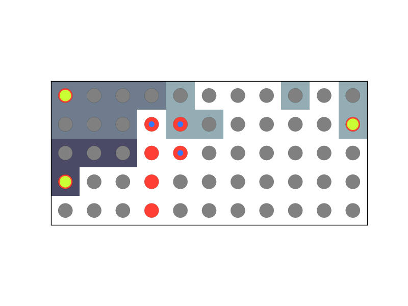

# Avida Spatial Tools
Python tools for working with environment files and spatial data generated by [Avida](https://github.com/devosoft/avida)

#Dependencies:
* Python2.x - (Pysal is the only real impediment to using 3.x, though)
* [Matplotlib](http://matplotlib.org/)
* [Seaborn](https://github.com/mwaskom/seaborn) - handles colors beautifully
* [Numpy](http://www.numpy.org/)
* [Scipy](http://www.scipy.org/)
* [Pysal](https://github.com/pysal/pysal) - for spatial analysis

#Workflow:

* Parse the data:
  * One environment file: parse_environment_file()
  * Multiple environment files: parse_environment_file_list()
  * One or more grid_task files: load_grid_data()
* Transform the data (optional):
  * Convert values to counts of tasks performed or resources available: make_count_grid()
  * Convert phenotype values to numbers representing deviations from then optimal phenotype: make_optimal_phenotype_grid()
  * Convert values to ranks indicating the complexity of a phenoytype or resource set relative to others in the environment: assign_ranks_by_cluster()
  * Convert values to lists representing the percentage of organisms in that cell doing each task: task_percentages()
* Aggregate the data (if you have multiple files):
  * agg_grid()
* Visualize the data:
  * Color grid
  * Color grid by hue mixing
  * Overlay circles representing phenotypes on colored grid representing environment
    * Represent phenotypes as circles with single color
    * Represent phenotypes as concentric circles representing tasks that individual can do
  * Make a movie showing overlaid phenotypes changing over time

#Development:
If you have requests for new features submit an issue or e-mail me - I'm happy to add things! Or, if you feel so inclined, feel free to implement them yourself and send me a pull request. I've tried to keep things pretty modular, so it shouldn't be too hard. I use py.test for testing because it was the easiest testing framework to get working with image regregression tests.

#Development dependencies:
* [Py.test](http://pytest.org/latest/)
* [pytest-mpl](https://github.com/astrofrog/pytest-mpl) - plug-in for image regression tests
